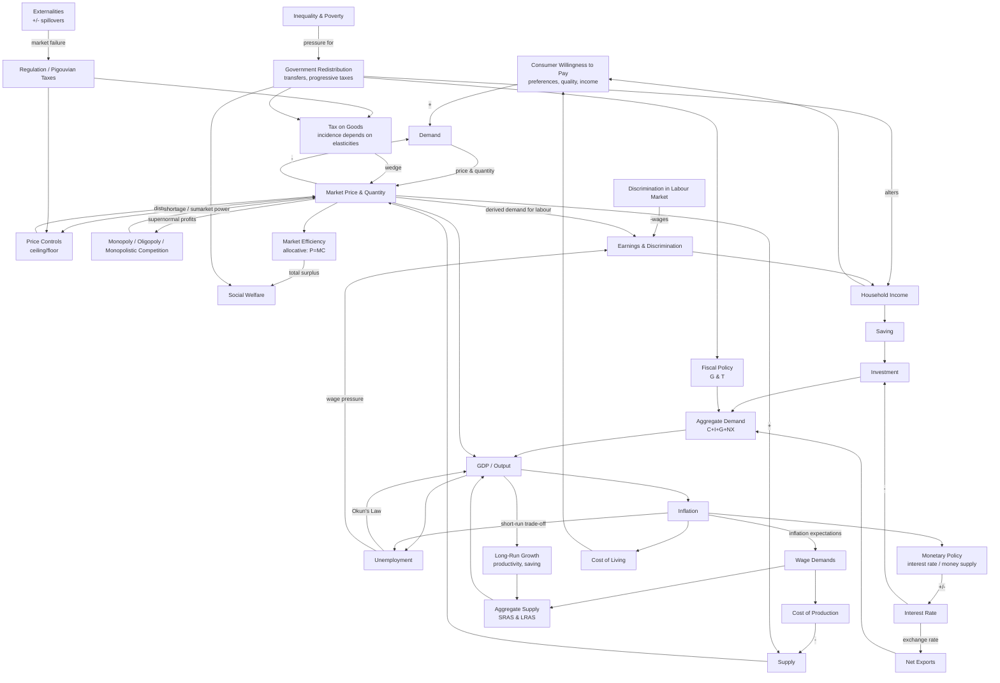

# Summary

Control on prices (too low / too high / just right) affects supply (seller) and demand (consumer).

* A price ceiling set below equilibrium creates a shortage (excess demand); a price floor set above equilibrium creates a surplus (excess supply).
* A price at the equilibrium level allows the market to clear without shortage or surplus.

A tax on goods, whether levied on sellers or buyers, affects the market outcome. The division of the tax burden (tax incidence) depends on the relative price elasticities of **both supply and demand**, not just supply elasticity. Other aspects of tax design (progressivity, administrative cost, deadweight loss, etc.) also warrant deep analysis.

Also consider consumer willingness to pay for a good (based on price, quality, preferences, income, etc.).

Market efficiency:

* Allocative efficiency means distributing resources to their highest‑valued uses and producing at the lowest possible cost, which maximises total surplus (consumer + producer surplus).
* Efficiency does **not** guarantee fairness (equity). Whether the government should intervene to redistribute resources is a normative question.

Externalities and regulations that affect markets.

Firms in competitive markets:

* Cost of production
* Revenue of a competitive firm

Monopoly\
Monopolistic competition\
Oligopoly

Earnings and discrimination\
Inequality and poverty\
Theory of consumer choice

**Microeconomics** (topics above +)

**Macroeconomics**\
Measuring a nation’s income\
Measuring the cost of living\
Production and growth\
Saving, investment, and the financial system\
Unemployment\
Monetary system\
Money growth and inflation\
A macroeconomic theory of the open economy\
Aggregate demand and aggregate supply\
The influence of monetary and fiscal policy on aggregate demand\
The short‑run trade‑off between inflation and unemployment
