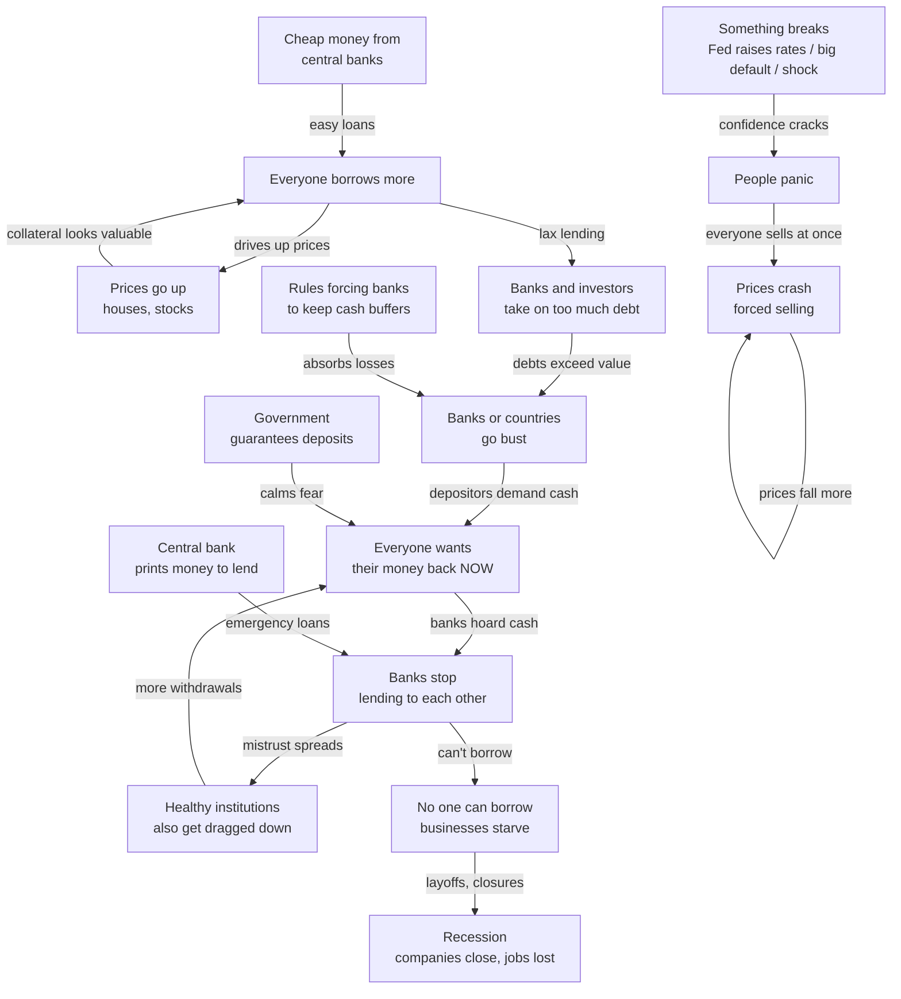

# Financial Crises



## How banks work

Banks transform short-term deposits into long-term loans — **maturity transformation**.

Simplified balance sheet (10% reserve ratio):

| Assets | Liabilities |
|---|---|
| Reserves: \$10 | Deposits: \$100 |
| Loans: \$90 | |

Normally 1-2% of depositors show up daily. Reserves cover it.

**Vulnerability**: assets (loans) are illiquid, liabilities (deposits) are demandable. If a depositor believes others will run, running is rational — even if the bank is solvent.

## Diamond-Dybvig model (Nobel 2022)

Two equilibria:
1. **Good**: everyone waits → bank functions, depositors get full value
2. **Bad**: everyone runs → fire sales → bank insolvent → depositors lose

Deposit insurance eliminates equilibrium 2. Before FDIC (1933), runs were rational.

## 2008 Global Financial Crisis

### Shadow banking

By 2007, ~50% of lending was through **shadow banks** — no deposits, no deposit insurance, no Fed access:

| Institution | Funds source | Assets |
|---|---|---|
| Money market funds | Overnight repo | SIV commercial paper |
| SIVs | 30-90 day CP | Subprime MBS (long-term) |
| Investment banks | Overnight repo | MBS, CDOs |
| AIG | Insurance premiums | CDS on MBS |

**Repo** works like a deposit: "I lend \$100M overnight, you give me Treasuries as collateral." Rolled daily. If collateral value is doubted, lender raises **haircut** or refuses to roll.

### The trigger

- **2004-2006**: 5M subprime mortgages originated → packaged into MBS → CDOs → CDO-squared. Rating agencies gave AAA to toxic pools.
- **2006**: US house prices peak.
- **2007**: Delinquencies rise. BNP Paribas freezes redemptions (Aug 9 — first signal). Bear Stearns hedge funds fail.
- **Mar 2008**: Bear Stearns acquired by JPMorgan (Fed guarantees losses).

### September 2008 — everything breaks

| Date | Event | Impact |
|---|---|---|
| Sept 7 | Fannie Mae, Freddie Mac taken over | Government backs housing |
| Sept 15 | Lehman Brothers Chapter 11 | No buyer, Fed refuses guarantee |
| Sept 16 | AIG bailout \$85B | Post-Lehman panic, CDS chain reaction |
| Sept 18-19 | Reserve Primary Fund "breaks the buck" | Money market fund held Lehman CP → investors redeem → systemic freeze. Treasury guarantees MMFs. SEC bans short-selling. |

### Why Lehman was catastrophic

Lehman held \$600B assets and was counterparty to everyone — derivatives, repo, swaps.

1. **Repo market froze**: lenders demanded Treasuries-only. Non-Treasury collateral unusable. Hedge funds couldn't fund → forced selling → crash.
2. **CDS chain**: AIG wrote \$440B in CDS on MBS. Lehman triggered margin calls AIG couldn't meet.
3. **CP market froze**: GE, Caterpillar couldn't roll commercial paper to fund payroll. Wall Street crisis → Main Street recession.

### The plumbing that saved the world

| Facility | What | When |
|---|---|---|
| PDCF | Fed lends directly to broker-dealers | Mar 2008 |
| TARP (\$700B) | Treasury buys toxic assets / injects capital | Oct 2008 |
| QE | Fed buys MBS and Treasuries → lowers long rates | Nov 2008 |
| Dollar swap lines | Fed gives dollars to ECB, BOE, BOJ | 2008-ongoing |

**Key insight**: 2008 was a **wholesale funding run** — not retail depositors, but institutional money (MMFs, repo, CP). Same logic as a bank run, no deposit insurance.

### Post-2008 regulation

| Rule | What it does |
|---|---|
| **Dodd-Frank** (2010) | Volcker Rule (no prop trading), enhanced supervision, stress tests |
| **Basel III** | Higher capital: CET1 ≥ 4.5% + 2.5% conservation buffer. LCR (30-day liquidity), NSFR (1-year stability). Leverage ratio ≥ 3% |
| **Resolution planning** | Living wills for too-big-to-fail banks |
| **Central clearing** | CCPs for derivatives — reduce counterparty risk |

## Great Depression (1929-1933)

- Oct 1929 crash: stocks -40% from peak.
- **1930-1933**: Four banking panics. 9,000 banks failed (40% of total).
- No deposit insurance. Runs were rational.
- **Fed did nothing** — even raised rates in 1931 to defend gold standard.
- Money supply fell 33%. Deflation ~10%/year.
- Friedman & Schwartz (1963): failure of the Fed to provide liquidity.

Lesson learned: 2008 Fed acted aggressively *because* the Great Depression showed the cost of inaction.

## How sovereign debt crises differ

A country with its own currency can't have a classic bank run (it can print money). But:

| Case | Problem |
|---|---|
| **Eurozone** (Greece 2010) | No printing press — like a bank run with no central bank backstop |
| **Emerging markets** (Argentina, Turkey) | Borrow in dollars, earn in local currency. Devaluation makes debt *more expensive* in local terms. "Original sin" — EMs can't borrow internationally in their own currency |

## Crisis propagation pattern

```
Credit boom → bubble → trigger → fire sales → insolvency → run → freeze → credit crunch → recession
```

Each crisis follows this pattern. The only difference is the *trigger* and the *type of run*:
- 1929: stock crash → retail bank run
- 2008: housing crash → wholesale funding run
- 2020 (COVID): health shock → corporate bond/Treasury dash-for-cash run (Fed stepped in immediately)
- 2023 (SVB): rate hike → unrealized bond losses → social-media-fueled depositor run on uninsured deposits

## Related

- [Capital Flows & Crises](capital-flows.md) — hot money, Asia 1997, EM crises
- [Shadow Banking](shadow-banking.md) — money market funds, repo, SIVs
- [Sovereign Debt & IMF](sovereign-debt.md) — default mechanics, IMF bailouts
- [The Dollar System](dollar-system.md) — Fed swap lines, reserve currency
