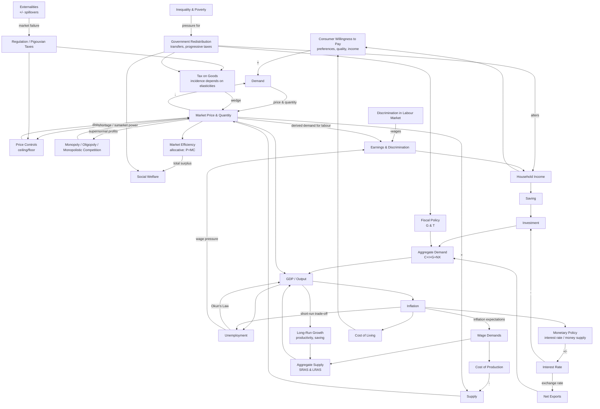

# Overview

### Quick links

- [Supply & Demand](micro/supply-demand.md)
- [Market Intervention](micro/market-intervention.md)
- [Welfare & Efficiency](micro/welfare-efficiency.md)
- [Externalities & Public Goods](micro/externalities.md)
- [Costs of Production](micro/production.md)
- [Market Structures](micro/market-structures.md)
- [Labor Markets & Inequality](micro/labor-markets.md)
- [Frontiers of Microeconomics](micro/frontiers.md)
- [GDP & Cost of Living](macro/gdp-cpi.md)
- [Growth & Finance](macro/growth-finance.md)
- [Unemployment](macro/unemployment.md)
- [Monetary System & Inflation](macro/monetary.md)
- [Open Economy](macro/open-economy.md)
- [Aggregate Demand & Supply](macro/ad-as.md)
- [Inflation & Unemployment](macro/phillips-curve.md)
- [Currency & Exchange Rates](global/currency.md)
- [Supply Chain Advantages](global/supply-chain.md)
- [Shadow Banking](global/shadow-banking.md)
- [The Dollar System](global/dollar-system.md)
